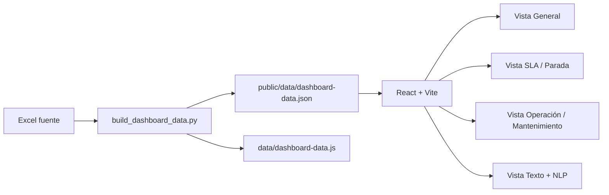

# Dashboard Tickets y SLA

Dashboard analítico en React + Vite construido sobre el Excel operativo del workspace. La aplicación organiza la lectura en cuatro vistas internas:

- General
- SLA / Parada
- Operación / Mantenimiento
- Texto + NLP

## Qué incluye

- Filtros globales por tiempo, territorio, operador, proyecto, prioridad, estado, fuente y grupo de escalamiento.
- KPIs ejecutivos para volumen, backlog, MTTR, cumplimiento SLA, parada acumulada y alertas narrativas.
- Mapa operacional con zoom, vista nacional por departamento y detalle municipal cuando se selecciona un territorio.
- Clasificación automática de comentarios por temas y alertas NLP, con búsqueda semántica sobre apertura, solución y etiquetas inferidas.
- Tablas exportables a CSV y Excel, con panel lateral por ticket para lectura ejecutiva, trazabilidad y revisión de comentarios.

## Uso diario recomendado

La forma más simple de trabajar es esta:

1. Deja el Excel actualizado en `datos/`.
2. Ejecuta `python iniciar_dashboard.py`.
3. El script regenera el dataset, levanta Vite y abre el dashboard en el navegador.

## Cómo levantarlo en localhost

Instala las dependencias del frontend una sola vez:

```powershell
npm install
```

Si también quieres regenerar el dataset desde Excel, instala las dependencias de Python:

```powershell
py -3 -m pip install -r requirements.txt
```

Luego puedes usar el flujo automático recomendado:

```powershell
python iniciar_dashboard.py
```

Si prefieres hacerlo por pasos, usa:

```powershell
npm run data
npm run dev
```

Luego abre:

```text
http://127.0.0.1:5173/
```

## Cómo regenerar el dataset

Desde la raíz del workspace:

```powershell
py -3 scripts/build_dashboard_data.py
```

Si quieres apuntar a otro archivo Excel:

```powershell
py -3 scripts/build_dashboard_data.py "ruta/al/archivo.xlsx"
```

El pipeline genera dos salidas:

- `public/data/dashboard-data.json`: fuente consumida por la app React.
- `data/dashboard-data.js`: salida legacy conservada como respaldo.

## Operación sin PC encendido (Drive compartido)

Para que el dashboard se actualice aunque tu PC esté apagado, se agregó un workflow de GitHub Actions que:

1. Descarga automáticamente el Excel más reciente desde una carpeta de Drive compartida.
2. Regenera el dataset.
3. Compila el frontend.
4. Publica en Firebase Hosting.

Archivo del workflow:

- `.github/workflows/sync-drive-and-deploy.yml`

Debes configurar estos secrets en GitHub (Settings -> Secrets and variables -> Actions):

1. `DASHBOARD_DRIVE_FOLDER`: folder ID o URL de la carpeta compartida de Drive (ese será el único lugar que alimenta el sistema).
2. `DASHBOARD_GOOGLE_CREDENTIALS_JSON`: JSON completo de una Service Account con permiso de lectura sobre esa carpeta.
3. `FIREBASE_TOKEN`: token de Firebase CLI para deploy hosting.

### Setup automatico de secrets (recomendado)

En Windows, puedes crear todos los secrets y disparar la primera ejecucion con un solo comando:

```powershell
pwsh -File scripts/setup_github_actions.ps1 -Repo "owner/repo" -GoogleCredsJsonPath "C:\ruta\service-account.json" -DriveFolder "https://drive.google.com/drive/folders/TU_FOLDER_ID" -FirebaseToken "TU_FIREBASE_TOKEN" -RunNow
```

Si omites algun parametro, el script te lo pide en consola.

Si no tienes `gh` instalado o esta carpeta no es un clon Git, usa este bootstrap (funciona por `owner/repo`):

```powershell
pwsh -File scripts/bootstrap_cloud_automation.ps1 -GithubRepo "owner/repo" -GithubToken "ghp_xxx" -DriveFolder "https://drive.google.com/drive/folders/TU_FOLDER_ID" -GoogleCredsJsonPath "C:\ruta\service-account.json" -FirebaseToken "TU_FIREBASE_TOKEN" -RunNow
```

Frecuencia actual:

- Cada 30 minutos (cron) y también manual (`workflow_dispatch`).

## Documentación

La explicación detallada de la infraestructura, el Excel, el pipeline Python, el frontend y la operación diaria está en [docs/README.md](docs/README.md).

## Flujo lógico



## Estructura

- `src/App.jsx`: orquestación de filtros, KPIs, vistas y estado de la app.
- `src/components/`: componentes de gráficos, tablas y panel lateral de detalle.
- `src/lib/analytics.js`: agregaciones, formato, filtros y lógica analítica reutilizable.
- `src/styles/app.css`: sistema visual del dashboard React.
- `scripts/build_dashboard_data.py`: parser del Excel y generador del dataset enriquecido con geografía y NLP.
- `iniciar_dashboard.py`: runner para levantar el dashboard con un solo comando.
- `datos/`: carpeta para dejar el Excel actualizado e ir conservando historial.
- `docs/`: documentación por capas del proyecto.
- `public/data/dashboard-data.json`: dataset principal para el frontend.
- `data/dashboard-data.js`: dataset legacy generado en paralelo.
